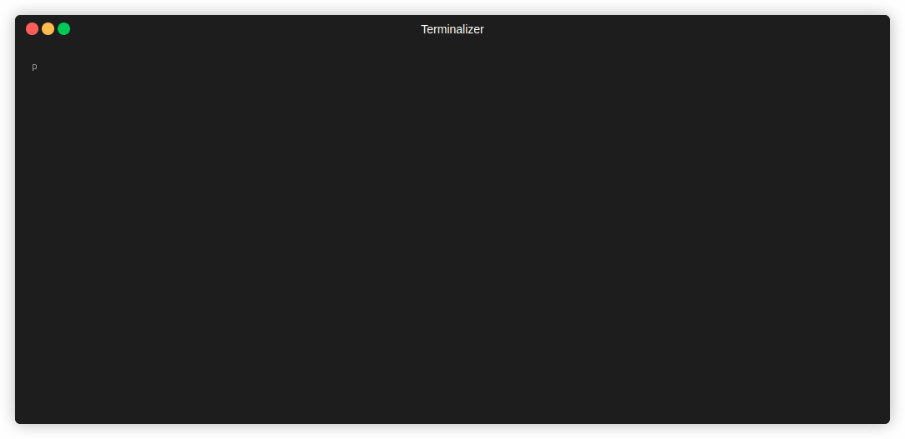

# Pizzeria Monitor 🍕



A real-time dashboard for monitoring pizzeria orders and sales, built with Python.


---

## Table of Contents 📜

- [Project Description](#project-description)
- [Features](#features)
- [Tech Stack](#tech-stack)
- [Installation](#installation)
- [Usage](#usage)
- [Project Structure](#project-structure)
- [Contributing](#contributing)
- [License](#license)
- [Important Links](#important-links)
- [Footer](#footer)

---

## Project Description 📝

The Pizzeria Monitor is a Python application designed to provide a live, terminal-based dashboard for a pizzeria. It simulates incoming orders, tracks their preparation status, and displays key statistics such as total orders, delivered orders, total revenue, and the most popular pizza. The dashboard updates in real-time, offering an immediate overview of the pizzeria's operations.

---

## Features ✨

- **Real-time Dashboard:** A live, updating console interface displaying crucial pizzeria metrics.
- **Order Simulation:** Simulates new orders with random customer names, pizzas, and prices.
- **Delivery Simulation:** Simulates the delivery of orders from 'In preparazione' to 'Consegnato'.
- **Database Integration:** Uses SQLite to store and manage order data.
- **Key Metrics Display:** Shows total orders, delivered orders, total revenue, and the top-selling pizza.
- **Kitchen Monitor:** Displays a list of orders currently being prepared.
- **Cash Register Monitor:** Summarizes sales and order statistics.
- **Customizable Limits:** Allows configuration of the number of orders displayed on the dashboard.

---

## Tech Stack 🛠️

- **Language:** Python 3.9+
- **Database:** SQLite
- **Libraries:**
    - `rich`: For creating beautiful and informative terminal-based interfaces.
    - `threading`: For running simulations concurrently.
    - `time`: For time-related operations.
    - `random`: For generating random data for simulations.

---

## Installation 🚀

There are no external dependencies to install as all required libraries (`sqlite3`, `threading`, `time`, `random`) are part of Python's standard library. The `rich` library is also a common and powerful terminal formatting library. 

1. **Clone the repository:**
   ```bash
   git clone https://github.com/Noylah/pizzeria-monitor.git
   cd pizzeria-monitor
   ```

2. **Run the application:**
   ```bash
   python main.py
   ```

---

## Usage 💡

To run the Pizzeria Monitor, simply execute the `main.py` script. The application will initialize the SQLite database, start order and delivery simulations in separate threads, and then launch a live, updating dashboard in your terminal.

**Real-world Use Case:**
This tool is ideal for small pizzerias looking for a simple, real-time way to visualize their order flow and sales without the need for complex or expensive Point of Sale (POS) systems. It provides immediate feedback on kitchen load and overall business performance.

**How to Use:**
1. Ensure you have Python installed on your system.
2. Clone the repository and navigate to its directory.
3. Run `python main.py`.
4. Observe the live dashboard in your terminal.
5. Press `CTRL + C` to stop the application.

---

## Project Structure 📁

```
pizzeria-monitor/
├── main.py         # Entry point, dashboard generation, and simulation management
├── db.py           # Database initialization and simulation logic
├── constants.py    # Configuration constants (DB name, order limit)
└── README.md       # Project documentation
```

---

## How to use 🤔

This project serves as a live monitoring system for a hypothetical pizzeria. It demonstrates:

1.  **Database Management:** Creating and interacting with an SQLite database to store order information (`db.py`).
2.  **Concurrency:** Using threading to run background simulations for new orders and order deliveries simultaneously (`main.py`, `db.py`).
3.  **Real-time UI:** Employing the `rich` library to create a dynamic and visually appealing dashboard directly in the terminal (`main.py`).

To use the project:

1.  Execute `python main.py`.
2.  The dashboard will appear, showing:
    *   **Kitchen Monitor:** A list of orders currently 'In preparazione', including ID, time, customer, pizza type, and price. The most recent order is highlighted.
    *   **Cash Register Monitor:** Overall statistics like total orders placed, orders delivered, total revenue, and the most frequently ordered pizza.
    *   **Footer:** Database information and the last update time.
3.  The simulation will continue until you manually stop it by pressing `CTRL + C`.

---

## Contributing 🤝

Contributions are welcome! If you have suggestions for improvements or find bugs, please feel free to:

- Open an issue on GitHub.
- Submit a pull request.

---

## License 📜

This project is not currently under any specified license. Use at your own discretion.

---

## Important Links 🔗

- **Repository:** [https://github.com/Noylah/pizzeria-monitor](https://github.com/Noylah/pizzeria-monitor)

---
© 2023 Noylah | Pizzeria Monitor

<p align="center">
  Built with ❤️ by Noylah
</p>
<p align="center">
  Star this repository ⭐ | Fork it 🍴 | Report issues 📣
</p>


---
**<p align="center">Generated by [ReadmeCodeGen](https://www.readmecodegen.com/)</p>**
